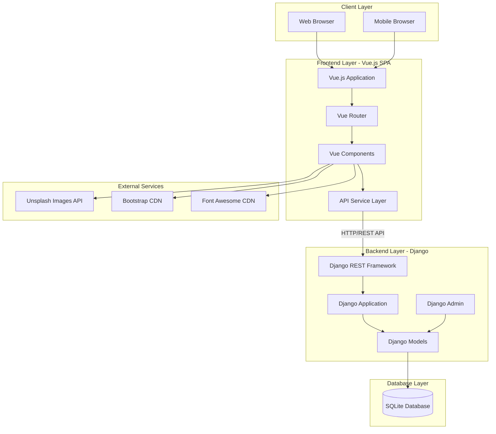
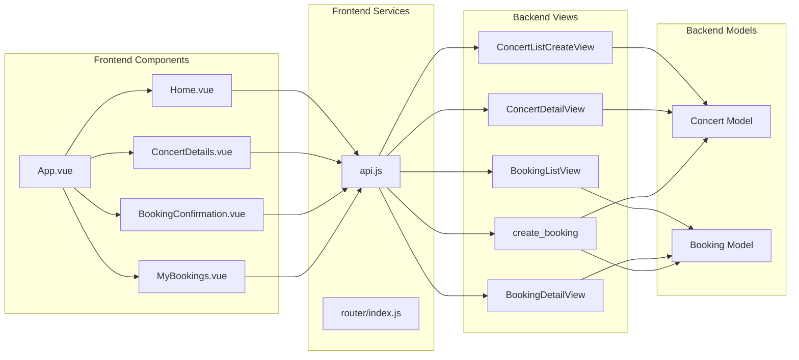
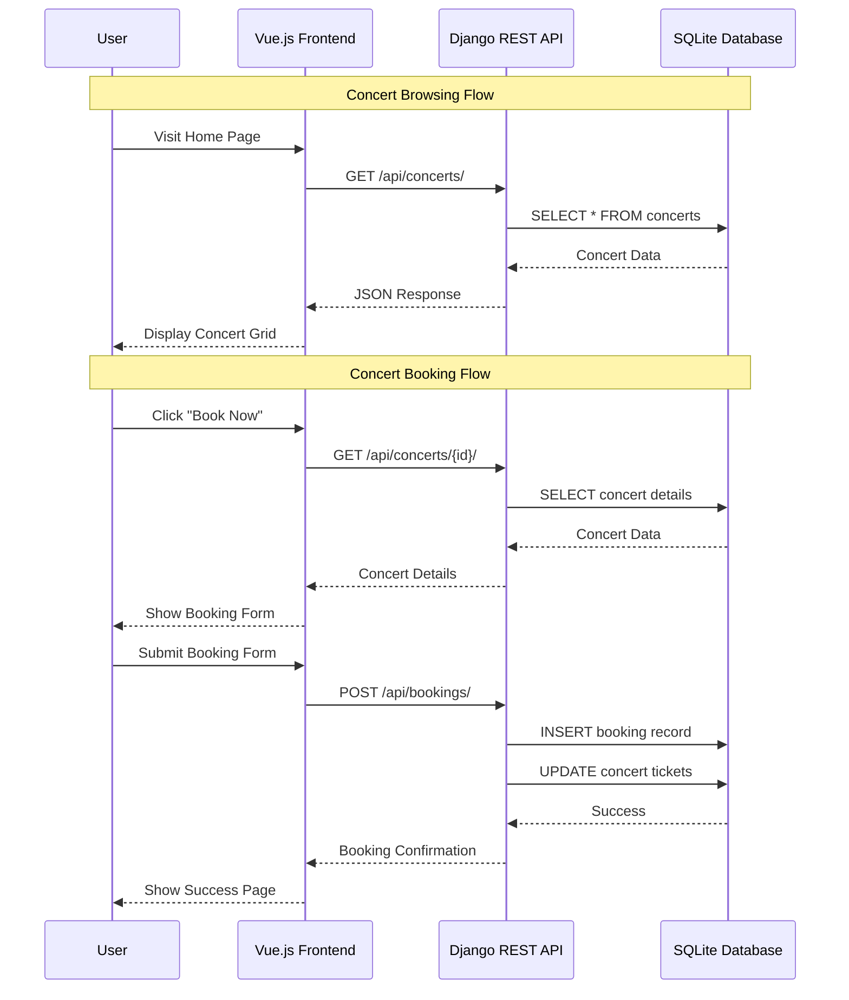
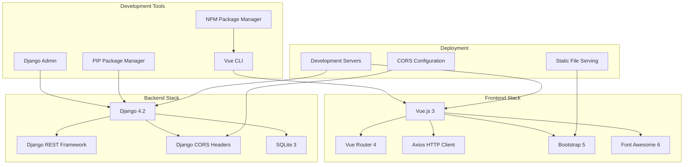
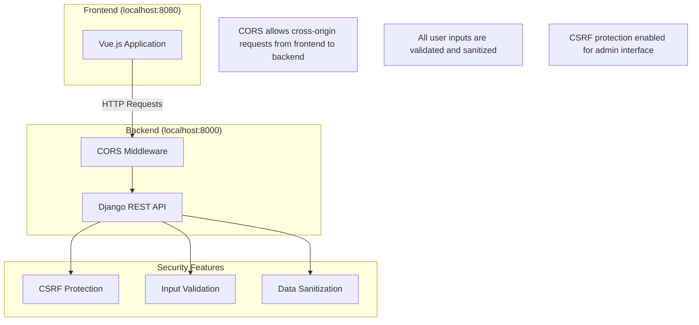

# System Architecture Diagram - Concert Booking App

## High-Level Architecture



## Detailed Component Architecture



## Data Flow Diagram



## Technology Stack Architecture



## API Endpoint Architecture

```mermaid
graph LR
    subgraph "Concert Endpoints"
        GET_Concerts[GET /api/concerts/]
        GET_Concert[GET /api/concerts/{id}/]
        POST_Concert[POST /api/concerts/]
    end

    subgraph "Booking Endpoints"
        POST_Booking[POST /api/bookings/]
        GET_Bookings[GET /api/bookings/list/]
        GET_Booking[GET /api/bookings/{id}/]
    end

    subgraph "Admin Endpoints"
        Admin_Panel[/admin/]
        Admin_Concerts[/admin/concerts/concert/]
        Admin_Bookings[/admin/concerts/booking/]
    end

    GET_Concerts --> ConcertModel[(Concert Model)]
    GET_Concert --> ConcertModel
    POST_Concert --> ConcertModel
    
    POST_Booking --> BookingModel[(Booking Model)]
    GET_Bookings --> BookingModel
    GET_Booking --> BookingModel
    
    Admin_Panel --> Admin_Concerts
    Admin_Panel --> Admin_Bookings
    Admin_Concerts --> ConcertModel
    Admin_Bookings --> BookingModel
```

## Security & CORS Configuration


