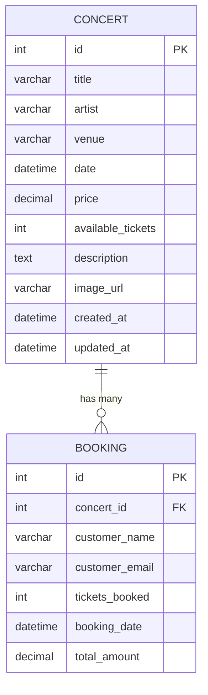

# Database Schema - Concert Booking System

## Entity Relationship Diagram (ERD)



## Database Tables Structure

### Concert Table
| Column | Type | Constraints | Description |
|--------|------|-------------|-------------|
| id | INTEGER | PRIMARY KEY, AUTO_INCREMENT | Unique concert identifier |
| title | VARCHAR(200) | NOT NULL | Concert title |
| artist | VARCHAR(100) | NOT NULL | Artist/performer name |
| venue | VARCHAR(200) | NOT NULL | Concert venue |
| date | DATETIME | NOT NULL | Concert date and time |
| price | DECIMAL(10,2) | NOT NULL | Ticket price |
| available_tickets | INTEGER | NOT NULL | Available ticket count |
| description | TEXT | NULLABLE | Concert description |
| image_url | VARCHAR(500) | NULLABLE | Concert image URL |
| created_at | DATETIME | AUTO_NOW_ADD | Record creation time |
| updated_at | DATETIME | AUTO_NOW | Last update time |

### Booking Table
| Column | Type | Constraints | Description |
|--------|------|-------------|-------------|
| id | INTEGER | PRIMARY KEY, AUTO_INCREMENT | Unique booking identifier |
| concert_id | INTEGER | FOREIGN KEY, NOT NULL | Reference to Concert |
| customer_name | VARCHAR(100) | NOT NULL | Customer full name |
| customer_email | VARCHAR(100) | NOT NULL | Customer email |
| tickets_booked | INTEGER | NOT NULL | Number of tickets booked |
| booking_date | DATETIME | AUTO_NOW_ADD | Booking creation time |
| total_amount | DECIMAL(10,2) | NOT NULL | Total booking amount |

## Sample Data

### Concerts
```sql
INSERT INTO concerts_concert (title, artist, venue, date, price, available_tickets, description, image_url) VALUES
('Rock Night Live', 'The Electric Guitars', 'Madison Square Garden', '2025-08-16 20:00:00', 75.00, 500, 'An electrifying rock concert...', 'https://images.unsplash.com/photo-1493225457124-a3eb161ffa5f?w=400'),
('Jazz Under the Stars', 'Smooth Jazz Ensemble', 'Blue Note', '2025-08-23 19:30:00', 45.00, 200, 'A smooth jazz evening...', 'https://images.unsplash.com/photo-1415201364774-f6f0bb35f28f?w=400'),
('Pop Sensation Tour', 'Luna Star', 'Arena Stadium', '2025-09-05 21:00:00', 120.00, 1000, 'The biggest pop sensation...', 'https://images.unsplash.com/photo-1540039155733-5bb30b53aa14?w=400'),
('Classical Symphony Night', 'City Orchestra', 'Concert Hall', '2025-09-12 18:00:00', 60.00, 300, 'Experience classical music...', 'https://images.unsplash.com/photo-1465847899084-d164df4dedc6?w=400');
```

### Bookings (Example)
```sql
INSERT INTO concerts_booking (concert_id, customer_name, customer_email, tickets_booked, total_amount) VALUES
(1, 'John Doe', 'john@example.com', 2, 150.00),
(2, 'Jane Smith', 'jane@example.com', 1, 45.00),
(3, 'Mike Johnson', 'mike@example.com', 4, 480.00);
```
