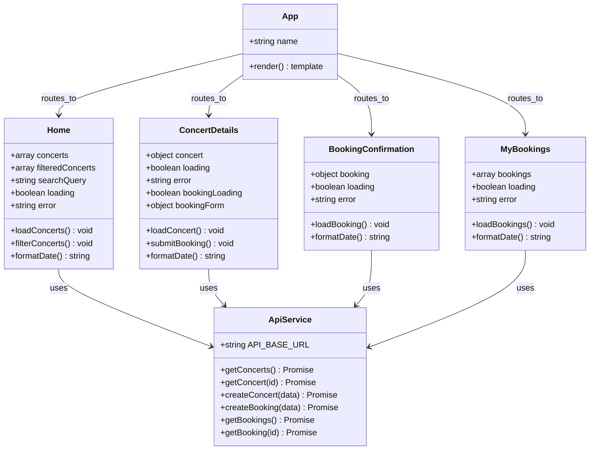
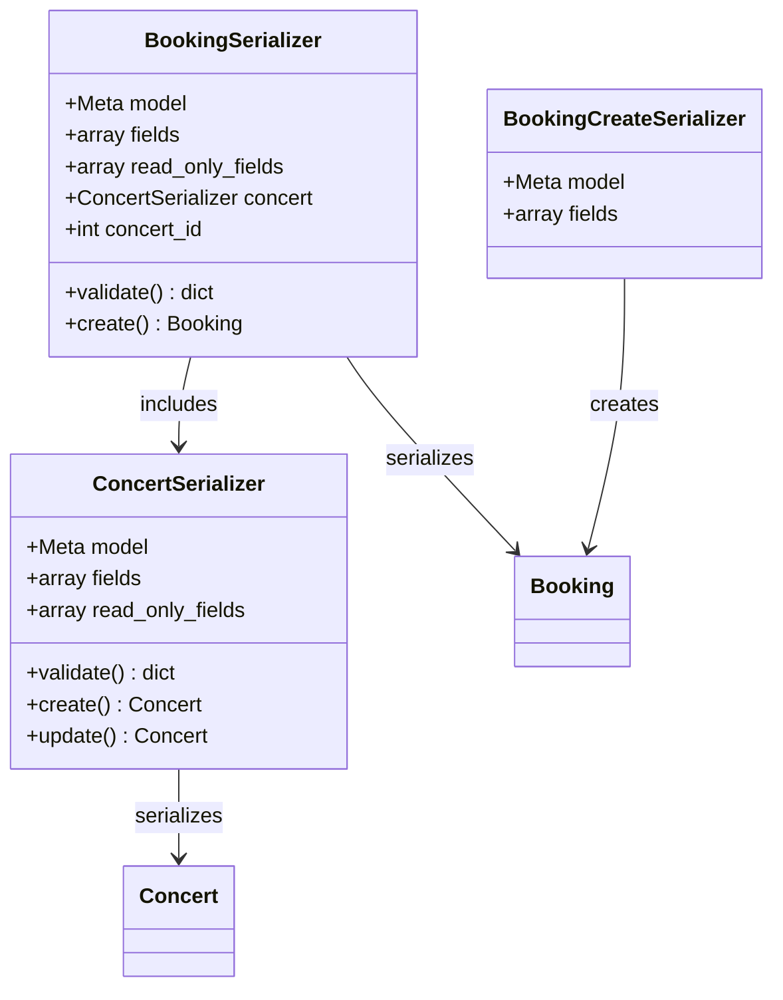
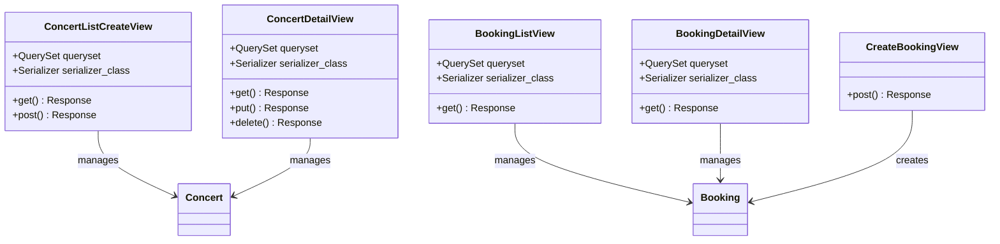
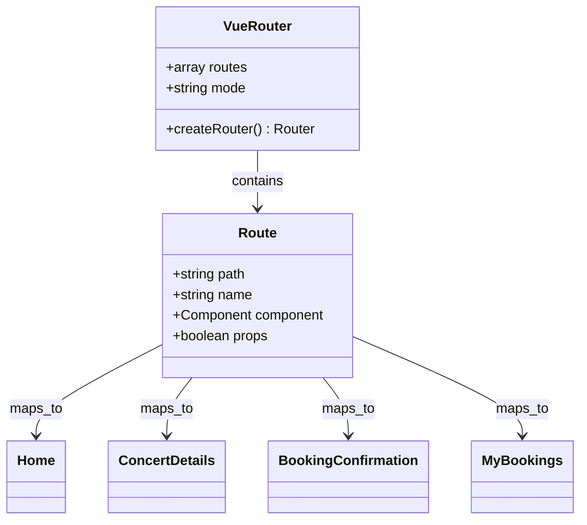

# UML Class Diagram - Concert Booking System

## Backend Models (Django)

```mermaid
classDiagram
    class Concert {
        +int id
        +string title
        +string artist
        +string venue
        +datetime date
        +decimal price
        +int available_tickets
        +text description
        +string image_url
        +datetime created_at
        +datetime updated_at
        +to_dict() dict
        +__str__() string
    }

    class Booking {
        +int id
        +int concert_id
        +string customer_name
        +string customer_email
        +int tickets_booked
        +datetime booking_date
        +decimal total_amount
        +to_dict() dict
        +save() void
        +__str__() string
    }

    Concert ||--o{ Booking : "has many bookings"
```

## Frontend Components (Vue.js)



## API Serializers (Django REST Framework)



## API Views (Django REST Framework)



## Vue.js Router Structure


